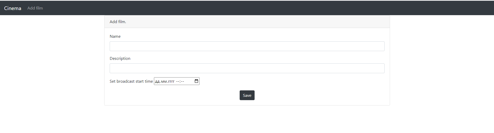
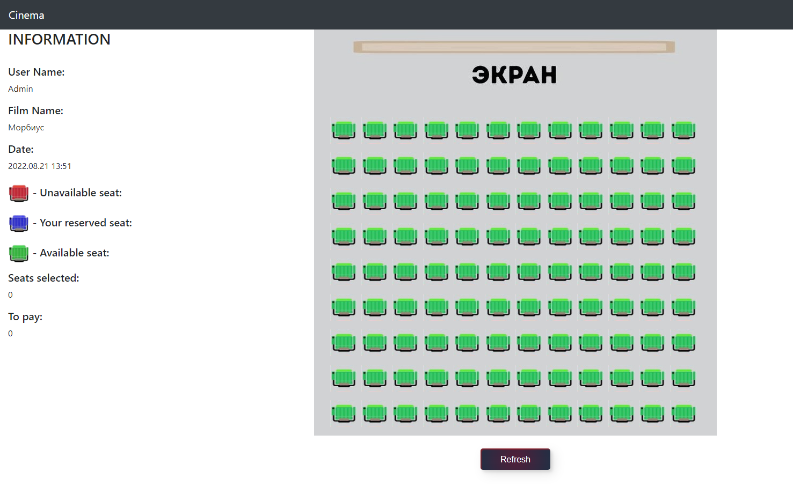
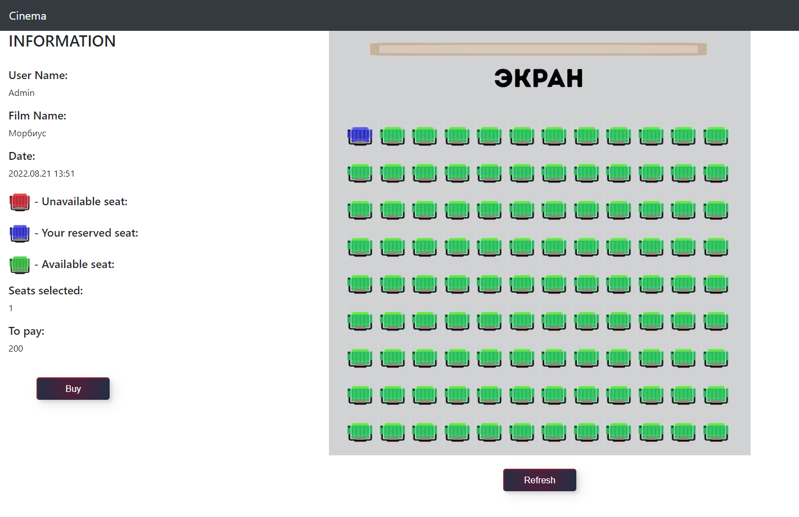

# Cinema

<a name="menu"></a>
<ul>
    <li>
        <a href="#about">О проекте</a>
        <ul>
            <li><a href="#description">Описание</a></li>
            <li><a href="#technologies">Технологии</a></li>
        </ul>
    </li>
    <li>
        <a href="#build">Сборка</a>
    </li>
    <li>
        <a href="#usage">Использование</a>
        <ul>
            <li><a href="#hall">Главная страница</a></li>
            <li><a href="#addFilm">Добавление фильма</a></li>
            <li><a href="#deleteFilm">Удаление фильма</a></li>
            <li><a href="#editMovie">Редактирование фильма</a></li>
            <li><a href="#movieDscription">Описание фильма</a></li>
            <li><a href="#choose">Выбор места</a></li>
            <li><a href="#byTicket">Покупка билета</a></li>
        </ul>
    </li>
</ul>

<h2><a name="about">О проекте</a>&nbsp;&nbsp;<a href="#menu">&#9650;</a></h2>
<h4><a name="description">Описание</a>&nbsp;&nbsp;<a href="#menu">&#9650;</a></h4>
<p>
    Сервис для покупки билетов в кинотеатр.
Что бы добавлять фильмы, удалять и редактировать, необходимо зарегистрироваться под ником Admin.
</p>

<h4><a name="technologies">Технологии</a>&nbsp;&nbsp;<a href="#menu">&#9650;</a></h4>
<ul>
    <li>Java 17</li>
    <li>PostgreSQL, JDBC, Liquibase</li>
    <li>Maven</li>
    <li>Spring boot</li>
    <li>HTML, CSS, Bootstrap, Thymeleaf JavaScript</li>
</ul>

</code></pre>

<h2><a name="build">Сборка</a>&nbsp;&nbsp;<a href="#menu">&#9650;</a></h2>
<ol>
    <li>
        Для успешной сборки и работы проекта на вашем компьютере должны быть установлены:
        <ol>
            <li>JDK 17(+)</li>
            <li>Maven</li>
            <li>PostgreSQL</li>
        </ol>
    </li>
    <li>
        В PostgreSQL создайте базу с именем "job4j_cinema"
    </li>
    <li>
        Скачайте проект к себе на компьютер с помощью команды<br>
        <code>git clone git@github.com:ValeraDanilov/job4j_cinema.git</code><br>
        перейдите в корень проекта
    </li>
    <li>
        Добавьте настройки для доступа к базе данных, для этого внесите соответствующие изменения в файле 
        <code>src/main/resources/db.properties</code><br>
        и в файле конфигурации проекта <code>pom.xml</code>

``` 
<profile>   
    <id>production</id>
    <properties>
        <db.url>jdbc:postgresql://127.0.0.1:5432/job4j_cinema</db.url>
        <db.username>postgres</db.username>
        <db.password>password</db.password>
        <db.driver>org.postgresql.Driver</db.driver>
    </properties>
</profile>
```

</li>
    <li>
        Выполните команду <code>mvn install</code> в корне проекта для его сборки<br>
        Будет выполнена миграция БД с помощью Liquibase.<br>
    </li>
    <li>
        Команда для запуска из консоли <code>java -jar target/job4j_cinema-1.0.jar</code> после чего перейдите по данной ссылке.<br>
        <a href="http://localhost:8080/sessions/">http://localhost:8080/sessions</a>
    </li>
</ol>
<h2><a name="usage">Использование</a>&nbsp;&nbsp;<a href="#menu">&#9650;</a></h2>
<h3><a name="hall">Главная страница</a>&nbsp;&nbsp;<a href="#menu">&#9650;</a></h3>
<p>
    Главная страница с выбором Фильм. Если вы хотите добавить новый фильм,
    удалить или отредактировать его, вам нужно зарегистрироваться под ником Admin.
    Что бы купить билет на фильм, нажмите на название фильма.
</p>
<p style="text-align: center">
  
</p>
<h3><a name="addFilm">Добавление фильма</a>&nbsp;&nbsp;<a href="#menu">&#9650;</a></h3>
<p>
    Под ником Admin у вас появится функция Добавить фильм (add Film).
</p>
<p style="text-align: center">
  
</p>
<h3><a name="deleteFilm">Удаление фильма</a>&nbsp;&nbsp;<a href="#menu">&#9650;</a></h3>
<p>
   Под ником Admin. Нажав на корзину возле название фильма, у вас всплывёт окно с подтверждением на удаление фильма.
</p>
<p style="text-align: center">
  
</p>
<h3><a name="editMovie">Редактирование фильма</a>&nbsp;&nbsp;<a href="#menu">&#9650;</a></h3>
<p>
Рядом с кнопкой удаления фильма есть кнопка для редактирование фильма.
</p>
<p style="text-align: center">
  
</p>
<h3><a name="movieDscription">Описание фильма</a>&nbsp;&nbsp;<a href="#menu">&#9650;</a></h3>
<p>
Нажав на название фильма, вы попадете на страницу фильма, где есть его описание,
дата и время трансляции. и кнопку для покупки билетов.
</p>
<p style="text-align: center">
  
</p>
<h3><a name="choose">Выбор места</a>&nbsp;&nbsp;<a href="#menu">&#9650;</a></h3>
<p>
Страница с выбором места. Слева находится информация, где указанно ваше имя, название фильма, дата его трансляции,
цвет какого сидения, что означает, а так же количество и цена билетов. После выбора места появится кнопка Оплатить.
</p>
<p style="text-align: center">
  
</p>
<h3><a name="byTicket">Покупка билета</a>&nbsp;&nbsp;<a href="#menu">&#9650;</a></h3>
<p>
Выбрав место и нажав Оплатить вам напишет, что вы успешно купили билеты.
</p>
<p style="text-align: center">
  
  
  
</p>
<p>
Если во время оплаты ваши места купит уже кто-то другой, то вам предложат выбрать новые места.
</p>
<p style="text-align: center">
  
</p>